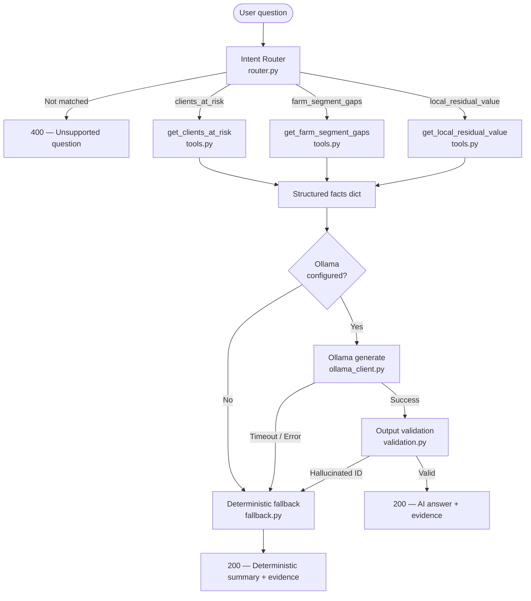
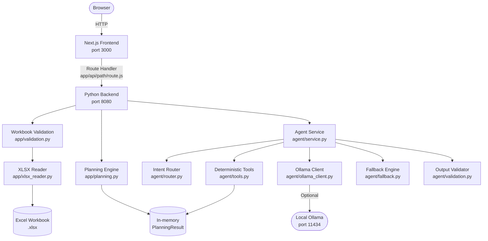
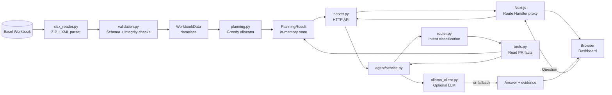
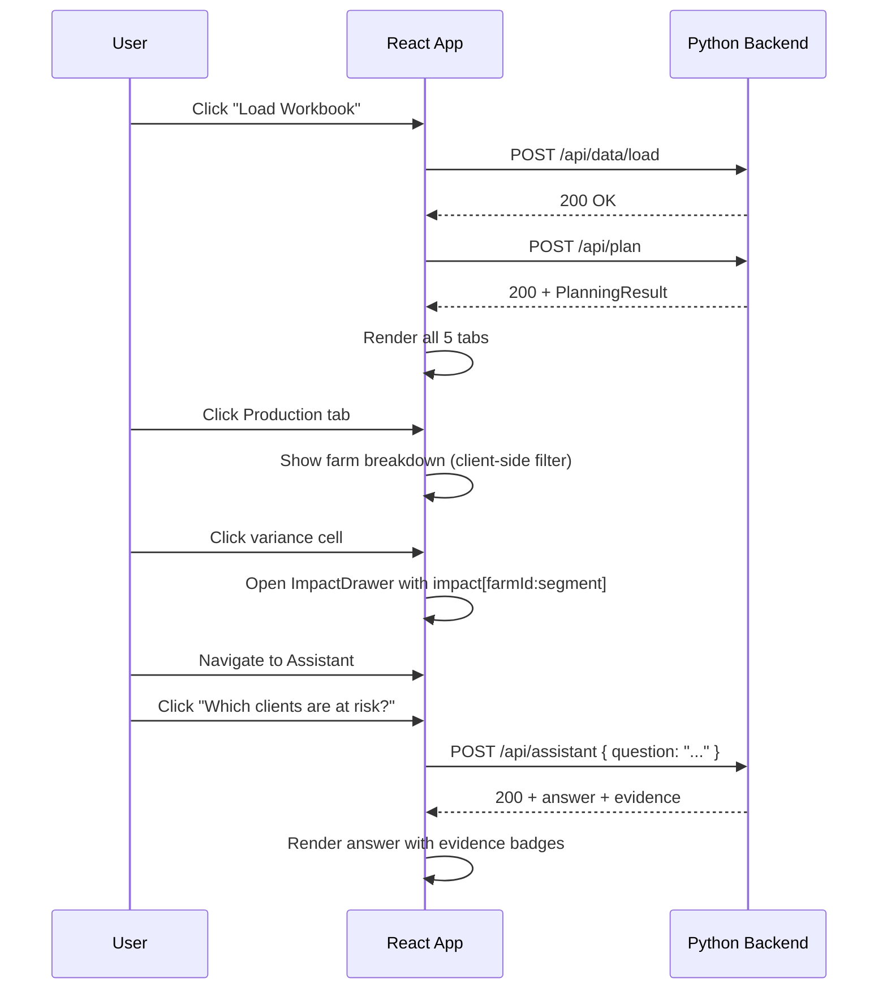
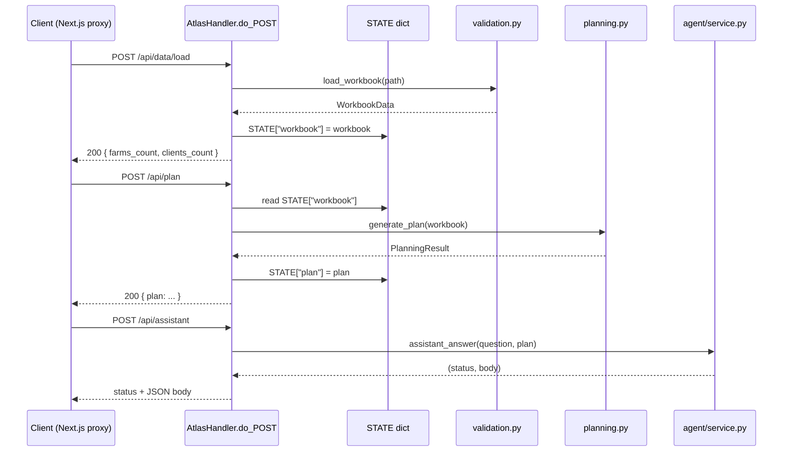

# Atlas Fresh — Daily Export Planner

> A browser-based decision-support workspace that combines a deterministic planning engine with an optional natural-language assistant, giving Production and Commercial teams a single, explainable view of each day's farm-to-client apple allocation.

---

## Table of Contents

1. [Project Overview](#1-project-overview)
2. [The Problem](#2-the-problem)
3. [The Solution](#3-the-solution)
4. [Key Features](#4-key-features)
5. [AI / Agent Architecture](#5-ai--agent-architecture)
6. [Why Deterministic Tools Matter](#6-why-deterministic-tools-matter)
7. [Complete Project Architecture](#7-complete-project-architecture)
8. [Repository Structure](#8-repository-structure)
9. [File & Module Responsibilities](#9-file--module-responsibilities)
10. [Detailed Tool Documentation](#10-detailed-tool-documentation)
11. [End-to-End Examples](#11-end-to-end-examples)
12. [Data Flow](#12-data-flow)
13. [API Documentation](#13-api-documentation)
14. [Frontend Architecture](#14-frontend-architecture)
15. [Backend Architecture](#15-backend-architecture)
16. [Security & Reliability](#16-security--reliability)
17. [Testing](#17-testing)
18. [Local Development](#18-local-development)
19. [Configuration](#19-configuration)
20. [Design Decisions](#20-design-decisions)
21. [Limitations](#21-limitations)
22. [Future Improvements](#22-future-improvements)
23. [Hackathon / Demo Section](#23-hackathon--demo-section)
24. [Tech Stack](#24-tech-stack)

---

## 1. Project Overview

**Atlas Fresh** is a daily decision-support workspace for apple export operations. It solves the concrete, daily workflow problem faced by Production and Commercial teams who must reconcile actual farm receipts against pre-season client programmes — every single day — before dispatch closes.

The application allows teams to:

- **Load** the authoritative planning workbook (Excel) and validate its integrity automatically
- **Calculate** an optimal daily farm-to-client export allocation, respecting segment quality rules and the conditioning station's 500 t/day throughput limit
- **Inspect** every KPI, farm variance, client shortage, and allocation line in a structured multi-tab dashboard
- **Query** the plan in natural language — asking which clients are at risk, where the biggest farm production gaps are, and how much fruit is going to the local market and at what value
- **Trace** any farm-segment variance directly through to affected export clients

The target users are **Production and Commercial planning managers** who need reliable, explainable answers from their daily operational data without building SQL queries or manipulating spreadsheets.

---

## 2. The Problem

Each day at Atlas Fresh:

- **20 farms** deliver actual apple volumes that differ from the pre-season capacity plan
- Apples are classified into four quality segments (A, B, C, D), with A being the hardest to produce and most commercially valuable
- All export-bound fruit must pass through a single export conditioning station with a hard capacity of **500 t/day**
- **10 export clients** each hold a commercial programme specifying volume, segment quality requirement, and acceptance mode (EXACT match or MINIMUM quality)
- The season data contains **no pre-defined farm-to-client mapping** — the allocation must be solved fresh every day against actual receipts

The daily meeting between Production and Commercial must answer:

| Question | Why it is hard |
|---|---|
| Which clients will not be fully served today? | Allocation is NP-style: segment compatibility, capacity constraints, and price ordering interact |
| Which farm / segment shortfall is causing the most commercial damage? | Requires tracing from segment to client through a greedy allocator |
| How much fruit goes to local market and at what value? | Local residual is priced at 10 % of reference export price — a significant discount |
| Why is Segment A below plan and who is exposed? | A is the rarest and most constrained segment; a shortfall cascades directly to EXACT-A clients |

Without a decision-support tool, this analysis is done manually in spreadsheets — slowly, inconsistently, and without the ability to easily ask natural-language follow-up questions on the calculated result.

---

## 3. The Solution

Atlas Fresh replaces spreadsheet analysis with three cooperating layers:

### Layer 1 — Deterministic Planning Engine

A pure-Python allocator reads the validated workbook and solves the daily allocation in a single deterministic pass. Every KPI (exported tonnes, local residual, revenue, client shortage, variance) is computed from authoritative workbook data with no approximations. The result is reproducible: given the same input, the same plan is always produced.

### Layer 2 — Browser Dashboard

A Next.js / React frontend exposes five views — Overview, Production, Commercial, Allocations, and Planning Assistant — with interactive impact tracing, client shortage drill-down, and allocation-line filtering. The dashboard consumes the server-generated plan; it never recalculates anything itself.

### Layer 3 — Natural-Language Planning Assistant

An optional AI assistant answers analytical questions about the calculated plan. The design principle is strict:

> **The AI is not the source of truth. The deterministic engine is.**

The assistant's role is limited to:

1. Understanding what the user is asking (intent routing)
2. Identifying whether an approved analytical capability exists for that question
3. Calling the appropriate deterministic data tool
4. Receiving the structured, server-sourced facts
5. Producing a clear natural-language explanation of those facts

The AI never calculates, never modifies data, and never invents values. If Ollama is unavailable or unconfigured, the assistant automatically produces a deterministic text summary from the same tool output — with no degradation in factual accuracy.

---

## 4. Key Features

| Feature | Status | Description |
|---|---|---|
| Workbook loading & validation | ✅ Implemented | Reads `.xlsx` via Python stdlib, validates all sheets, IDs, mix sums, multiples of 5 |
| Deterministic allocation engine | ✅ Implemented | Greedy price-ordered allocator with segment compatibility and station capacity enforcement |
| Planning invariant verification | ✅ Implemented | Post-allocation integrity checks (no overallocation, mass balance) |
| Overview dashboard | ✅ Implemented | KPIs, decision flow, value strip, segment bars, client risk panel |
| Production tab | ✅ Implemented | Per-farm segment matrix with variance highlighting and alert triggers |
| Commercial tab | ✅ Implemented | Client programme table with fulfillment %, shortage reason, revenue |
| Allocations tab | ✅ Implemented | Line-by-line farm-segment-to-client allocation with multi-column filtering |
| Impact drawer | ✅ Implemented | Click any farm/segment variance to see which clients are affected |
| Client trace drawer | ✅ Implemented | Click any client to see all supplying farm allocations and quality upgrade labels |
| Planning Assistant (AI mode) | ✅ Implemented | Ollama-powered natural-language explanation when `OLLAMA_MODEL` is set |
| Planning Assistant (deterministic fallback) | ✅ Implemented | Always-available grounded summary, no Ollama required |
| Intent routing | ✅ Implemented | Regex + score-based classifier; 3 supported topics, out-of-scope rejection |
| Tool allowlist enforcement | ✅ Implemented | Only 3 approved tools; any other tool name raises immediately |
| Output validation | ✅ Implemented | AI responses checked for hallucinated farm/client IDs before display |
| Global search | ✅ Implemented | Cross-tab search field filters farm and client tables simultaneously |
| Production alerts | ✅ Implemented | Segment and farm-segment gap alerts with clickable impact triggers |
| No external Python dependencies | ✅ Implemented | Pure stdlib: `http.server`, `zipfile`, `xml.etree`, `unittest` |

---

## 5. AI / Agent Architecture



### Step-by-Step Flow

**Step 1 — User submits a question**
The browser POSTs `{ "question": "..." }` to `/api/assistant`.

**Step 2 — Intent routing (`agent/router.py`)**
A regex + scoring classifier matches the question against three supported intents:
- `clients_at_risk` → `get_clients_at_risk`
- `farm_segment_gaps` → `get_farm_segment_gaps`
- `local_residual_value` → `get_local_residual_value`

Questions matching reject patterns (e.g. "change", "optimize", "write python") or scoring zero on all intents return HTTP 400 immediately, before any tool is called.

**Step 3 — Deterministic tool call (`agent/tools.py`)**
The router-selected tool reads facts directly from the in-memory `PlanningResult` object — the same object computed by the deterministic engine. No LLM is involved at this stage. The tool returns:
- A `facts` dict (the payload for the AI or fallback)
- A `valid_entities` dict (whitelists of real farm IDs, client IDs, and segments for output validation)

**Step 4 — AI or deterministic path**
- If `OLLAMA_MODEL` is not set → `generate_deterministic_fallback()` converts the facts into a formatted text summary directly.
- If `OLLAMA_MODEL` is set → `OllamaClient.generate_explanation()` sends the system prompt + facts to the local Ollama instance and receives a JSON response.

**Step 5 — Output validation (`agent/validation.py`)**
Every AI response is parsed and checked: the `answer` text must not mention client IDs (`C##`) or farm IDs (`F##`) that do not appear in the known-entity whitelist. Evidence items are validated the same way. Any hallucination triggers an automatic fallback to the deterministic path.

**Step 6 — Response**
The final response includes: `answer` (text), `evidence` (list of typed entity references), `mode` (`"ai"` or `"deterministic"`), and `provider_state` (displayed in the UI).

---

## 6. Why Deterministic Tools Matter

### The Core Principle

The assistant never sees raw database rows or free-form data. It only receives structured facts extracted by approved, read-only deterministic tools. This is a deliberate architectural choice.

### The Tool Allowlist

`agent/tools.py` defines `APPROVED_TOOLS`:

```python
APPROVED_TOOLS = {
    "get_clients_at_risk",
    "get_farm_segment_gaps",
    "get_local_residual_value",
    "reject_question",
}
```

`run_tool()` checks the requested tool name against this set before execution:

```python
def run_tool(name: str, plan: Any):
    if name not in APPROVED_TOOLS:
        raise ValueError(f"Unauthorized tool: {name}")
    ...
```

There is no mechanism by which the LLM can request an arbitrary tool. The tool name is determined by the intent router — not by the model — so the model never controls which tool is called.

### Why This Matters for Reliability

| Risk | Mitigation |
|---|---|
| LLM invents a client shortage that doesn't exist | Tool output is the only source of client data; facts are checked before display |
| LLM uses a farm ID that doesn't exist in today's plan | Output validation rejects any `F##` not in the `all_known_farms` whitelist |
| LLM recalculates numbers differently from the engine | Numbers come from the engine's result, not from the model's reasoning |
| LLM calls an arbitrary function | Tool name is router-determined, not model-determined |
| LLM times out or is unavailable | Deterministic fallback produces identical factual content without the model |

### Reproducibility and Testing

Because the tool layer is pure Python and the facts are deterministic, the entire assistant pipeline — excluding the model inference itself — is unit-testable with synthetic plan objects. The test suite mocks `OllamaClient` to exercise every path (AI success, timeout, connection error, hallucinated output, unsupported question) independently of any running Ollama instance.

---

## 7. Complete Project Architecture



**Runtime state** is held entirely in memory. There is no database, no file system cache beyond the workbook, and no external service dependency beyond optional Ollama.

---

## 8. Repository Structure

```text
Qarizmi_Atlas Fresh.../
│
├── Makefile                         # All developer commands (dev, test, install, etc.)
├── README.md                        # Original brief README
├── README1.md                       # This document
│
├── .env                             # Local Ollama configuration (not committed to VCS)
│
├── backend/
│   ├── server.py                    # HTTP server entrypoint (ThreadingHTTPServer)
│   ├── data/
│   │   └── Atlas_Fresh_Production_Commercial_Data.xlsx   # Authoritative workbook
│   ├── app/
│   │   ├── __init__.py
│   │   ├── models.py                # Dataclasses: Farm, Client, Station, PlanningResult, ...
│   │   ├── planning.py              # Deterministic allocation engine
│   │   ├── validation.py            # Workbook validation and parsing
│   │   └── xlsx_reader.py           # Zero-dependency Excel reader (stdlib only)
│   └── tests/
│       ├── test_planning.py         # Planning engine unit tests
│       └── test_assistant.py        # Re-exports agent tests for `make test`
│
├── agent/
│   ├── __init__.py                  # Exports AssistantService, assistant_answer
│   ├── service.py                   # Orchestrator: routing → tools → Ollama → fallback
│   ├── router.py                    # Constrained intent classifier (regex + scoring)
│   ├── tools.py                     # Three approved deterministic data tools
│   ├── fallback.py                  # Deterministic text summary generator
│   ├── ollama_client.py             # Local Ollama HTTP client (stdlib urllib)
│   ├── prompts.py                   # System prompt and user prompt builder
│   ├── validation.py                # AI output parser + entity hallucination checker
│   ├── check_ollama.py              # CLI tool: check Ollama availability and model
│   └── tests/
│       ├── __init__.py
│       └── test_assistant.py        # 18 unit tests covering all assistant code paths
│
└── frontend/
    ├── next.config.mjs              # Next.js config (no rewrites; proxy via Route Handler)
    ├── jsconfig.json                # Path alias: @/* → ./
    ├── package.json                 # next ^16.3.5, react ^19.3.0
    ├── app/
    │   ├── layout.jsx               # Root layout, fonts, metadata
    │   ├── globals.css              # All CSS (custom design system, no Tailwind)
    │   ├── page.jsx                 # Entire single-page application (~1600 lines)
    │   └── api/
    │       └── [...path]/
    │           └── route.js         # Catch-all proxy Route Handler → Python backend
    ├── components/
    │   └── ui/
    │       ├── badge.jsx            # Badge component
    │       ├── button.jsx           # Button + IconButton components
    │       ├── card.jsx             # Card, CardHeader, CardTitle, CardContent
    │       ├── input.jsx            # Input component
    │       ├── select.jsx           # Select component
    │       ├── sheet.jsx            # Slide-in drawer panel
    │       ├── table.jsx            # Table + TableWrap components
    │       └── tabs.jsx             # Tabs component
    └── lib/
        └── utils.js                 # cn() class-name utility
```

---

## 9. File & Module Responsibilities

### `backend/server.py`

**Purpose:** The HTTP server entrypoint. Accepts requests, dispatches to the planning engine or agent service, and sends JSON responses.

**How it works:** Subclasses Python's `BaseHTTPRequestHandler` with HTTP/1.1 support enabled (`protocol_version = "HTTP/1.1"`) and wraps it in a custom `AtlasFreshServer(ThreadingHTTPServer)` that silently suppresses `BrokenPipeError` / `ConnectionResetError` from client disconnects. Global `STATE` dict holds the parsed workbook and calculated plan in memory between requests.

**Important classes/functions:**

| Name | Role |
|---|---|
| `AtlasHandler` | Request handler: routes `GET`/`POST` to the correct logic |
| `AtlasFreshServer` | ThreadingHTTPServer subclass; suppresses client-disconnect noise |
| `load_default_workbook()` | Finds and parses the `.xlsx` workbook, populates `STATE` |
| `calculate_plan()` | Calls the planning engine, stores result in `STATE` |
| `assistant_answer(question)` | Delegates to `agent.service.assistant_answer` |
| `send_json(status, payload)` | Serializes and writes a JSON response with CORS headers |
| `to_jsonable(value)` | Recursively converts dataclasses / lists / dicts to JSON-safe types |

**Why it exists:** Keeps the API layer to a single file with zero external dependencies; no WSGI framework, no FastAPI.

---

### `backend/app/models.py`

**Purpose:** All data model dataclasses used across the application.

**Important classes:**

| Class | Role |
|---|---|
| `Farm` | One farm: ID, name, expected capacity, expected segment mix, actual segment tonnes |
| `Client` | One export client: ID, name, acceptance mode, requested segment, demand, price |
| `Station` | Export conditioning station: capacity, local market ratio, reference prices per segment |
| `WorkbookData` | Aggregate of `farms`, `clients`, `station` |
| `SupplyLot` | A mutable (farm, segment) supply unit used during allocation |
| `Allocation` | One allocation line: farm → segment → client, tonnes, price, revenue |
| `LocalResidual` | Unexported supply: farm, segment, tonnes, reference price, local value |
| `ClientResult` | Post-allocation client view: allocated, remaining, revenue, status, shortage reason |
| `PlanningResult` | Complete plan: all KPIs, allocations, residuals, clients, farms, impact map |

**Why it exists:** Strongly-typed models make the planning engine testable and the agent tools verifiable without needing to inspect raw dicts.

---

### `backend/app/xlsx_reader.py`

**Purpose:** Reads an Excel `.xlsx` file using only Python standard library (`zipfile` + `xml.etree.ElementTree`). No `openpyxl`, no `pandas`.

**How it works:** An `.xlsx` file is a ZIP archive. The reader extracts `xl/workbook.xml` (sheet list), `xl/sharedStrings.xml` (cell string pool), and each `xl/worksheets/sheetN.xml` (cell values). It resolves shared-string references, coerces numeric cells, and returns a `dict[sheet_name, list[list[Any]]]`. `table_from_header()` then locates the first cell matching a header name and returns subsequent rows as `list[dict]`.

**Why it exists:** Eliminates all Python dependency management for the data layer.

---

### `backend/app/validation.py`

**Purpose:** Validates the parsed workbook and constructs typed `WorkbookData`.

**How it works:** Checks for required sheets, validates each farm ID against `F\d{2}`, verifies segment mix sums to 1.0 within tolerance, checks that all actual quantities are non-negative multiples of 5 t, validates client acceptance modes and segment labels, detects duplicate IDs, and validates station configuration. Collects all errors before raising `WorkbookValidationError` so the UI can show all problems at once.

**Why it exists:** Separating validation from the planning engine means the engine receives only clean, typed data and can assume all invariants hold.

---

### `backend/app/planning.py`

**Purpose:** The deterministic allocation engine. Given a `WorkbookData`, produces a `PlanningResult`.

**How it works:**

1. Builds `SupplyLot` objects for every non-zero (farm, segment) actual quantity
2. Sorts clients by export price descending (highest-value clients allocated first), then by ID for stability
3. In a greedy loop: for each client, selects compatible supply lots (segment passes acceptance mode check), sorted by minimum quality upgrade distance then farm ID, allocates in 5-tonne steps until demand met, supply exhausted, or station capacity reached
4. Remaining supply becomes `LocalResidual` at 10 % of segment reference price
5. Computes all KPIs, segment variances, farm rows, production alerts, and the impact map
6. Calls `enforce_invariants()` to verify mass balance and no-overallocation

**Acceptance mode logic:**
- `EXACT`: only the exact requested segment is compatible
- `MINIMUM`: any segment with quality rank ≤ the requested segment is compatible (A is rank 0, D is rank 3; a MINIMUM-B client accepts A or B)

**Important functions:**

| Function | Role |
|---|---|
| `generate_plan(data)` | Main entrypoint; returns `PlanningResult` |
| `is_compatible(client, segment)` | Segment compatibility check |
| `sorted_clients(clients)` | Price-descending, ID-ascending sort |
| `_client_results(...)` | Determines status and shortage reason for each client |
| `_farm_rows(data, residuals)` | Builds per-farm segment breakdown dicts for the frontend |
| `_impact_map(result)` | Maps every `farm:segment` key to affected clients and allocation lines |
| `enforce_invariants(data, result)` | Post-hoc integrity verification |

---

### `agent/service.py`

**Purpose:** Orchestrates the complete assistant pipeline for one question.

**How it works:** `AssistantService.answer_question(question, plan)` runs:
1. `route_intent(question)` → intent + tool name, or 400 if unsupported
2. `run_tool(tool_name, plan)` → facts + valid entities, or 500 if tool raises
3. If Ollama not configured → `generate_deterministic_fallback()`
4. Otherwise: `OllamaClient.generate_explanation()` → `validate_ai_response()` → success or fallback on any error

All Ollama error classes (`OllamaNotConfiguredError`, `OllamaTimeoutError`, `OllamaConnectionError`, `OllamaMalformedResponseError`, `OutputValidationError`) are caught and routed to the deterministic fallback. A broad `except Exception` is the final safety net.

The module-level `assistant_answer(question, plan)` function called by `server.py` creates a fresh `AssistantService` on every request so that changes to `OLLAMA_MODEL` / `OLLAMA_TIMEOUT` environment variables are respected without restarting the server.

---

### `agent/router.py`

**Purpose:** Classifies a user question into one of three supported intents, or rejects it.

**How it works:**

1. Strips and lowercases the input
2. Checks against `REJECT_PATTERNS` (modify, recalculate, python, weather, etc.) — returns `None` on any match
3. Checks for canonical phrases with exact substring matching
4. Scores the question against three pattern lists (CLIENT_RISK_PATTERNS, FARM_SEGMENT_PATTERNS, LOCAL_RESIDUAL_PATTERNS) plus high-signal keywords (`client`, `farm`, `segment`, `local`, etc.) and specific ID patterns (`C0\d+`, `F0\d+`)
5. Returns the highest-scoring intent if score > 0, otherwise `None`

**Why it exists:** The LLM must never select its own tool. Keeping routing deterministic prevents prompt-injection attacks where the user tricks the model into calling an unapproved capability.

---

### `agent/tools.py`

**Purpose:** Three approved read-only data extraction tools, each producing structured facts from the `PlanningResult`.

**Why it exists:** Isolating data extraction into named, tested functions makes the AI layer's data source auditable and independently unit-testable.

---

### `agent/fallback.py`

**Purpose:** Generates a complete, grounded text summary from tool output facts — with no LLM involved.

**How it works:** Switches on `intent` and constructs a readable paragraph from the facts dict. Numbers and IDs come exclusively from the facts dict; no values are hardcoded or estimated. The fallback also produces a structured `evidence` list matching the same format as validated AI output.

**Why it exists:** Ensures the assistant is always useful, even with no Ollama installation or when the model times out or produces invalid output.

---

### `agent/ollama_client.py`

**Purpose:** HTTP client for local Ollama inference.

**How it works:** Sends a `POST /api/chat` request to Ollama with `stream: false` and `format: "json"` to request structured JSON output. Tries both `localhost` and `127.0.0.1` endpoints for resilience. Maps HTTP errors, timeouts, and connection failures to typed exception classes consumed by `service.py`.

**Configuration:** Reads `OLLAMA_BASE_URL` (default `http://localhost:11434`), `OLLAMA_MODEL` (required for AI mode), and `OLLAMA_TIMEOUT` (default 120 s). Parameters passed to the constructor take strict precedence over environment variables — passing `model=""` explicitly disables Ollama even if `OLLAMA_MODEL` is set in the environment.

---

### `agent/prompts.py`

**Purpose:** System prompt and user prompt construction.

**System prompt:** Instructs the model to act as a read-only explanation layer, to use only provided facts, to never invent IDs or numbers, and to respond in a specific JSON schema (`{ "answer": "...", "evidence": [...] }`).

**`build_user_prompt(question, facts)`:** Injects the original question and the JSON-serialized facts dict into the user turn.

---

### `agent/validation.py`

**Purpose:** Validates and sanitises AI model output before it reaches the user.

**How it works:**
1. Strips markdown code fences if present
2. Parses as JSON; raises `OutputValidationError` if not valid JSON or not a dict
3. Extracts `answer` (must be non-empty string) and `evidence` (must be list)
4. Scans the `answer` text for `C##` and `F##` references and checks each against the `all_known_clients` / `all_known_farms` whitelists
5. Validates each evidence item's type and ID against the same whitelists
6. Deduplicates evidence

Any validation failure raises `OutputValidationError`, which triggers the deterministic fallback in `service.py`.

---

### `agent/check_ollama.py`

**Purpose:** CLI diagnostic tool. Checks whether the Ollama server is reachable, lists available models, and reports whether the configured model is installed.

**Usage:** `make agent` (loads `.env` first)

---

### `frontend/app/page.jsx`

**Purpose:** The entire single-page application. All five workspace views, all state management, and all component trees live in this one file (~1,600 lines).

**Key sections:**

| Lines | Content |
|---|---|
| 1–54 | Imports, constants (`QUESTIONS`, `TABS`, `SEGMENTS`), formatters, `api()` helper |
| 80–344 | `PlannerPage` — root component: all React state, `loadWorkbook`, `recalculatePlan`, `askAssistant`, view routing |
| 346–568 | Shared layout components: `SidebarNav`, `PageHead`, `Metric`, `MiniBar`, `DecisionFlow`, `SegmentBars`, `EmptyState`, `ValidationError`, `ServerError` |
| 633–852 | `Overview` — main dashboard view |
| 854–1015 | `Production` — farm breakdown table with impact triggers |
| 1046–1173 | `Commercial` — client programme table with shortage trace |
| 1175–1339 | `Allocations` — allocation line table with multi-column filter |
| 1357–1490 | `AssistantView` — question buttons, free-text input, answer display with evidence badges |
| 1492–1615 | `ImpactDrawer`, `ClientTraceDrawer` — slide-in detail panels |

---

### `frontend/app/api/[...path]/route.js`

**Purpose:** Next.js App Router catch-all Route Handler that proxies every `/api/*` request to the Python backend.

**Why it exists:** The Turbopack dev server's built-in `rewrites()` proxy causes `ECONNRESET` on POST requests against the Python HTTP/1.1 server. This Route Handler owns the full request/response cycle using Node.js's own fetch/undici client, eliminating the proxy reliability issue. It strips hop-by-hop headers, forwards the request body as an `ArrayBuffer`, and streams the backend response body unchanged. Returns HTTP 502 with a JSON error body if the backend is unreachable.

---

### `frontend/components/ui/`

**Purpose:** Lightweight, custom UI primitives. No Tailwind. No component library.

| File | Components exported |
|---|---|
| `badge.jsx` | `Badge` |
| `button.jsx` | `Button`, `IconButton` |
| `card.jsx` | `Card`, `CardHeader`, `CardTitle`, `CardContent` |
| `input.jsx` | `Input` |
| `select.jsx` | `Select` |
| `sheet.jsx` | `Sheet` (slide-in drawer) |
| `table.jsx` | `Table`, `TableWrap` |
| `tabs.jsx` | `Tabs` |

All components use `cn()` from `lib/utils.js` for conditional class composition and apply CSS custom properties defined in `globals.css`.

---

## 10. Detailed Tool Documentation

### `get_clients_at_risk`

**Purpose:** Extracts structured facts about every client that is not fully served.

**Input:** `PlanningResult` (read-only)

**Output:**
```json
{
  "intent": "clients_at_risk",
  "total_clients": 10,
  "at_risk_count": 3,
  "clients": [
    {
      "client_id": "C02",
      "client_name": "...",
      "requested_quality": "A",
      "acceptance_mode": "EXACT",
      "wanted_tonnes": 50.0,
      "received_tonnes": 0.0,
      "still_needed_tonnes": 50.0,
      "service_level": "unserved",
      "plain_reason": "insufficient compatible segment supply available"
    }
  ]
}
```

**Logic:** Filters `plan.clients` for `status != "COMPLETE"`. Maps `shortage_reason` codes to human-readable strings. Classifies each client as `"partially served"` (allocated > 0) or `"unserved"` (allocated = 0).

**Deterministic guarantee:** All values come directly from `ClientResult` dataclass fields populated by the engine. The tool reads and returns; it does not compute.

---

### `get_farm_segment_gaps`

**Purpose:** Extracts structured facts about farm and segment production shortfalls.

**Input:** `PlanningResult` (read-only)

**Output:**
```json
{
  "intent": "farm_segment_gaps",
  "primary_segment_shortfalls": [
    { "segment": "A", "expected_tonnes": 150.0, "actual_tonnes": 90.0, "variance_tonnes": -60.0 }
  ],
  "significant_farm_gaps": [
    { "farm_id": "F05", "farm_name": "...", "segment": "A", "expected_tonnes": 20.0, "actual_tonnes": 5.0, "variance_tonnes": -15.0 }
  ]
}
```

**Logic:** Reads `plan.segment_variance_t` for aggregate segment gaps. Reads `plan.farms` (list of dicts) for per-farm-segment variances. Returns all negative-variance segments; returns the 6 worst farm-segment gaps sorted by variance ascending.

---

### `get_local_residual_value`

**Purpose:** Extracts structured facts about fruit diverted to the local market.

**Input:** `PlanningResult` (read-only)

**Output:**
```json
{
  "intent": "local_residual_value",
  "tonnes_going_local": 60.0,
  "estimated_local_value_eur": 4500.0,
  "exported_tonnes": 500.0,
  "station_limit_tonnes": 500.0,
  "total_received_tonnes": 560.0,
  "station_is_full": true,
  "pricing_explanation": "Local residual fruit is valued at 10% of the segment reference export price",
  "main_farms_sending_local": [...]
}
```

**Logic:** Reads `plan.local_residuals`, `plan.local_t`, `plan.local_value_eur`, `plan.exported_t`, `plan.station_capacity_t`. Derives `station_is_full` from `exported_t >= station_capacity_t`.

---

### `run_tool(name, plan)`

**Purpose:** Dispatch gate that enforces the tool allowlist.

**Logic:**
```python
if name not in APPROVED_TOOLS:
    raise ValueError(f"Unauthorized tool: {name}")
```
Returns the output of the named tool function. Called by `agent/service.py` wrapped in a `try/except` so that unexpected tool errors return HTTP 500 instead of closing the connection.

---

## 11. End-to-End Examples

### Example 1 — Clients at Risk

```text
User:  "Which clients are at risk and why?"

  ↓  router.py classifies → INTENT_CLIENTS_AT_RISK

  ↓  tools.get_clients_at_risk(plan)
        → C02: EXACT-A, 50 t wanted, 0 t received (insufficient Segment A supply)
        → C09: EXACT-A, 30 t wanted, 0 t received (insufficient Segment A supply)
        → C08: MINIMUM-B, 40 t wanted, 20 t received (station capacity reached)

  ↓  (Ollama not configured) → fallback.generate_deterministic_fallback()

  ↓  Response:
     "Planning Assistant — deterministic summary

      Ollama is not configured. Showing a deterministic summary instead.

      3 clients are at risk today:
      • C02 is unserved (50.0 t remaining, requested Segment A) because
        insufficient compatible segment supply available.
      • C09 is unserved (30.0 t remaining, requested Segment A) because
        insufficient compatible segment supply available.
      • C08 is partially served (20.0 t remaining, requested Segment B) because
        export conditioning station capacity reached (500t limit)."

     Evidence badges: C02, C09, C08
```

---

### Example 2 — Farm and Segment Gaps

```text
User:  "Which farm/segment gaps matter most today?"

  ↓  router.py classifies → INTENT_FARM_SEGMENT_GAPS

  ↓  tools.get_farm_segment_gaps(plan)
        → Segment A: expected 150 t, actual 90 t, variance -60 t
        → top 6 farm-segment shortfalls

  ↓  (Ollama configured) → OllamaClient.generate_explanation()
        → model returns JSON { "answer": "...", "evidence": [...] }

  ↓  validation.validate_ai_response()
        → checks all F## and C## mentions against known entity lists
        → strips any hallucinated IDs

  ↓  Response: AI explanation with verified evidence badges
```

---

### Example 3 — Local Residual Value

```text
User:  "Why are 60t going local and what is their estimated value?"

  ↓  router.py classifies → INTENT_LOCAL_RESIDUAL_VALUE

  ↓  tools.get_local_residual_value(plan)
        → 60.0 t going local
        → EUR 4,500 estimated local value
        → station is full (500 t exported = 500 t capacity)

  ↓  fallback or Ollama (depending on configuration)

  ↓  Response:
     "60.0 t of fruit are diverted to the local market because
      the export conditioning station reached its maximum 500 t/day
      capacity limit (total received: 560 t).
      The estimated local value is EUR 4,500, calculated at 10%
      of the segment reference export price."
```

---

### Example 4 — Out-of-Scope Rejection

```text
User:  "Change the allocation for C02."

  ↓  router.py: "change" matches REJECT_PATTERNS

  ↓  HTTP 400 — No tool called, no model invoked

  ↓  Response:
     "I can only explain:
      • clients at risk
      • farm/segment supply gaps
      • local residual tonnes and value"
```

---

### Example 5 — Hallucination Blocked

```text
User:  "Which clients are at risk?"

  ↓  Ollama returns: { "answer": "C99 is at risk.", "evidence": [{"type":"client","id":"C99"}] }

  ↓  validation.validate_ai_response():
        → "C99" not in all_known_clients → OutputValidationError

  ↓  service.py catches → generate_deterministic_fallback()

  ↓  Response: deterministic summary, C99 never shown to user
     provider_error: "invalid_model_output"
```

---

## 12. Data Flow



---

## 13. API Documentation

All endpoints are served by `backend/server.py` at `http://127.0.0.1:8080` and proxied through Next.js at `http://localhost:3000/api/*`.

---

### `GET /api/health`

**Purpose:** Liveness check. Confirms the server is running and the workbook is locatable.

**Response:**
```json
{ "ok": true, "status": "PLAN_CALCULATED", "workbook": "Atlas_Fresh_Production_Commercial_Data.xlsx" }
```

---

### `POST /api/data/load`

**Purpose:** Reads the workbook from disk, validates it, and stores the result in server memory.

**Request body:** None

**Success (200):**
```json
{ "ok": true, "status": "DATA_VALIDATED", "farms_count": 20, "clients_count": 10 }
```

**Validation failure (422):**
```json
{
  "ok": false,
  "status": "Data validation failed",
  "errors": [
    { "sheet": "Farms", "entity_id": "F03", "field": "expected_mix", "problem": "mix does not sum to 1.0" }
  ]
}
```

**Server error (500):**
```json
{ "ok": false, "error": "server_error", "message": "..." }
```

---

### `POST /api/plan`

**Purpose:** Runs the deterministic allocation engine against the loaded workbook and stores the result. Also auto-loads the workbook if not already loaded.

**Request body:** None

**Success (200):** Full `PlanningResult` as JSON — all KPIs, `allocations[]`, `local_residuals[]`, `clients[]`, `farms[]`, `production_alerts[]`, `impact{}`.

**Error (422/500):** Validation or planning invariant failure with details.

---

### `GET /api/plan`

**Purpose:** Returns the last calculated plan from memory without recalculating.

**Success (200):** Same shape as `POST /api/plan` response.

**Not yet calculated (404):**
```json
{ "ok": false, "error": "empty_state", "message": "No calculated plan is available." }
```

---

### `POST /api/assistant`

**Purpose:** Answers a natural-language question about the current plan.

**Request body:**
```json
{ "question": "Which clients are at risk and why?" }
```

**Success — AI mode (200):**
```json
{
  "ok": true,
  "status": "success",
  "mode": "ai",
  "intent": "clients_at_risk",
  "provider_state": "AI Assistant (mistral:latest)",
  "answer": "3 clients are at risk today...",
  "evidence": [
    { "type": "client", "id": "C02" },
    { "type": "client", "id": "C09" }
  ]
}
```

**Success — Deterministic fallback (200):**
```json
{
  "ok": true,
  "status": "fallback",
  "mode": "deterministic",
  "intent": "clients_at_risk",
  "provider_error": "not_configured",
  "provider_state": "Ollama is not configured. Showing a deterministic summary instead.",
  "answer": "Planning Assistant — deterministic summary\n\n...",
  "evidence": [...]
}
```

**Unsupported question (400):**
```json
{
  "ok": false,
  "status": "unsupported",
  "mode": "deterministic",
  "error": "unsupported_question",
  "message": "I can only explain:\n• clients at risk\n• farm/segment supply gaps\n• local residual tonnes and value",
  "evidence": []
}
```

**Bad JSON (400):**
```json
{ "ok": false, "error": "bad_json", "message": "Invalid JSON request." }
```

**Tool error (500):**
```json
{ "ok": false, "error": "server_error", "message": "..." }
```

---

## 14. Frontend Architecture

### Application Shell

`PlannerPage` (in `app/page.jsx`) is the single root component. It holds all application state via `useState`:

| State | Type | Purpose |
|---|---|---|
| `view` | string | Active tab: `overview / production / commercial / allocations / assistant` |
| `plan` | object\|null | Full `PlanningResult` from the server |
| `status` | string | UI status label (e.g. "Plan calculated") |
| `busy` | boolean | Loading spinner control |
| `error` | string\|null | Server error message |
| `validationErrors` | array | Workbook validation error details |
| `filters` | object | Allocation tab column filters |
| `assistant` | object | `{ loading, answer, error, lastQuestion }` |
| `customQuestion` | string | Free-text assistant input |
| `impactKey` | string\|null | Selected `"farmId:segment"` key for impact drawer |
| `selectedClientTrace` | object\|null | Selected client for trace drawer |
| `globalSearch` | string | Cross-tab search term |

### API Communication

The `api(path, options)` helper wraps `fetch`. It:
- Always sends `Content-Type: application/json`
- Awaits `response.json()` regardless of status
- Throws a typed error with `.payload` and `.status` on non-2xx responses

### User Interaction Flow



### View Components

| Component | Tab | What it renders |
|---|---|---|
| `Overview` | Overview | DecisionFlow, KPI metrics, value strip, segment bars, client risk list, allocation summary |
| `Production` | Production | Segment KPI cards, production alerts, filterable farm matrix with per-segment variance |
| `Commercial` | Commercial | At-risk summary, client programme table with fulfillment progress bars and shortage trace |
| `Allocations` | Allocations | Multi-column filtered allocation line table; farms + clients dropdown filters |
| `AssistantView` | Assistant | Suggested question buttons, free-text input, answer card with evidence badges |

### Drawer Panels

- **`ImpactDrawer`**: Shows actual/expected/allocated/local for a farm segment, lists affected clients and direct allocation lines
- **`ClientTraceDrawer`**: Shows demand/allocated/shortage/revenue for a client, lists all supplying farm allocations with quality upgrade labels

### Styling

All CSS is hand-written in `globals.css` using CSS custom properties. No Tailwind, no CSS-in-JS framework. Typography uses Google Fonts: **Plus Jakarta Sans** (body/UI) and **JetBrains Mono** (numeric values). Icons use **Material Symbols Rounded** (Google Fonts icon font).

---

## 15. Backend Architecture

### Request Lifecycle



### Workbook Search Path

The server searches for the workbook in this order:
1. `ATLAS_WORKBOOK_PATH` environment variable (if set)
2. `backend/data/Atlas_Fresh_Production_Commercial_Data.xlsx`
3. `backend/public/Atlas_Fresh_Production_Commercial_Data.xlsx`
4. `backend/Atlas_Fresh_Production_Commercial_Data.xlsx`

### Threading

`AtlasFreshServer(ThreadingHTTPServer)` creates a new OS thread per connection. The global `STATE` dict is accessed from multiple threads. The planning engine and workbook loading are only called when `STATE["plan"]` is `None`, making concurrent conflicts on startup transient and low-risk for this single-workbook use case.

### Error Handling

| Scenario | HTTP Status | Behaviour |
|---|---|---|
| Workbook not found | 500 | `server_error` |
| Workbook validation failure | 422 | Full error list returned |
| Planning invariant failure | 500 | `planning_invariant_failed` |
| Unsupported assistant question | 400 | `unsupported_question` |
| Tool extraction failure | 500 | `tool_error` |
| AI response invalid / hallucinated | 200 (fallback) | Deterministic summary |
| Client disconnects mid-response | Suppressed | `BrokenPipeError` caught in `AtlasFreshServer.handle_error` |

---

## 16. Security & Reliability

### Tool Allowlist

The only tools the assistant can invoke are those explicitly listed in `APPROVED_TOOLS`. The tool name is selected by the intent router, not by the model. An unauthorized name raises `ValueError` immediately.

### Intent Rejection

Before any tool is called, the question is evaluated against `REJECT_PATTERNS`. Questions containing modification verbs (`change`, `update`, `delete`, `optimize`, `recalculate`) are rejected with HTTP 400 without calling any tool or model.

### Input Validation

- Workbook loading validates every field: ID formats, numeric bounds, segment mix sums, multiples of 5, duplicates
- The assistant endpoint validates `Content-Length` and JSON decode before processing
- Empty or non-string questions short-circuit in the router

### Output Validation

Every AI response is scanned for `C##` and `F##` patterns in the answer text. Any ID not present in the engine's output triggers `OutputValidationError` and the deterministic fallback. This prevents the model from fabricating client or farm identifiers that would mislead planners.

### Read-Only Enforcement

The three approved tools read from `PlanningResult` using only `getattr` and dict access. No tool writes to `STATE`, modifies `PlanningResult`, or calls any mutating function. The test suite (`test_8_read_only_boundary`) verifies that calling all supported questions against a plan leaves the plan object unchanged.

### Environment Variables

Sensitive configuration (Ollama URL, model, timeout, server port) is loaded from `.env` via the Makefile (`set -a; . ./.env; set +a`). No secrets are hardcoded. `.env` is not committed to source control (it holds only local Ollama configuration, not API keys).

### Connection Reliability

- `protocol_version = "HTTP/1.1"` enables proper HTTP keep-alive to avoid proxy `ECONNRESET`
- `AtlasFreshServer.handle_error` suppresses `BrokenPipeError` / `ConnectionResetError` from client disconnects
- The assistant endpoint wraps `assistant_answer()` in `try/except Exception` so any uncaught error returns HTTP 500 instead of dropping the connection

---

## 17. Testing

### Test Suite

The project has **18 unit tests** across two test modules. All tests use Python's built-in `unittest` and require no external test runner.

### `agent/tests/test_assistant.py` — 11 tests

| Test | What it verifies |
|---|---|
| `test_router_all_supported_intents` | All 3 intents route correctly for representative questions |
| `test_1_grounded_supported_answer_clients_at_risk` | AI path returns valid response with real client IDs |
| `test_2_farm_segment_question` | AI path returns valid farm/segment evidence |
| `test_3_local_residual_question` | AI answer contains actual local_t and local_value_eur from plan |
| `test_4_unsupported_question` | Modification and out-of-scope questions return 400 |
| `test_5_unknown_evidence_id` | Hallucinated C99 in evidence triggers fallback |
| `test_6_ollama_unavailable` | `OllamaConnectionError` → deterministic fallback |
| `test_7_ollama_timeout` | `OllamaTimeoutError` → deterministic fallback |
| `test_8_read_only_boundary` | All assistant calls leave the plan object unchanged |
| `test_deterministic_fallback_when_not_configured` | `model=""` → `is_configured()` returns False → `"not_configured"` fallback |
| `test_deterministic_fallback_uses_server_result` | Fallback answer contains exact values from plan (no hardcoding) |

### `backend/tests/test_planning.py` — 7 tests

| Test | What it verifies |
|---|---|
| `test_baseline_output_from_workbook` | Full plan from real workbook: all KPIs, at-risk clients, shortage reasons |
| `test_client_price_ordering` | Clients sorted by price descending, then ID ascending |
| `test_exact_compatibility` | EXACT mode rejects non-matching segments |
| `test_minimum_compatibility_and_quality_preference` | MINIMUM mode upgrades quality, prefers least upgrade |
| `test_station_capacity_limit` | Station cap causes `STATION_CAPACITY_REACHED` shortage reason |
| `test_local_residual_calculation` | Local residual valued at 10 % of reference price |
| `test_invalid_workbook_validation_duplicate_client` | Duplicate client ID triggers `WorkbookValidationError` |

### `backend/tests/test_assistant.py`

Re-exports `TestAssistant` from `agent/tests/` so that `make test` (which discovers `backend/tests/`) runs all 18 tests in one command.

### Running Tests

```bash
# All tests (planning + assistant)
make test

# Agent tests only
make test-agent

# Both + frontend syntax check
make test-all
```

### What Is Not Tested

- HTTP handler (`server.py`) — no integration test exercises the actual HTTP server
- XLSX reader against malformed XML — only duplicate-ID corruption is tested
- Frontend components — no JavaScript unit tests exist

---

## 18. Local Development

### Requirements

| Requirement | Notes |
|---|---|
| Python 3.10+ | No pip packages required — pure standard library |
| Node.js 20+ / npm | For the Next.js frontend |
| Ollama (optional) | Only needed for AI mode; deterministic fallback always works |

### Installation

```bash
# Clone the repository and enter the project directory
cd "Qarizmi_Atlas Fresh_Weekend_Technical_Assessment_Pack"

# Install frontend dependencies (Next.js, React)
make install
```

### Environment Variables

Copy the bundled `.env` to customize:

```bash
# .env — already present in the repository root
OLLAMA_BASE_URL=http://localhost:11434
OLLAMA_MODEL=mistral:latest    # remove or leave blank to use deterministic fallback only
OLLAMA_TIMEOUT=120.0
PORT=8080
```

The `backend` and `dev` Makefile targets load `.env` automatically via `set -a; . ./.env; set +a`.

To run without Ollama, simply unset `OLLAMA_MODEL` or leave it empty.

### Run Development Environment

```bash
# Start both backend (port 8080) and frontend (port 3000) concurrently
make dev

# Start only the Python backend
make backend

# Start only the Next.js frontend
make frontend
```

Open **http://localhost:3000** in your browser.

### First-Run Workflow

1. Click **Load Workbook** in the sidebar — validates the `.xlsx` and calculates the plan automatically
2. Browse the **Overview**, **Production**, **Commercial**, and **Allocations** tabs
3. Navigate to **Assistant** and click a suggested question or type your own

### Check Ollama Configuration

```bash
make agent
```

This runs `agent/check_ollama.py`, which verifies server reachability and model availability.

### Stop All Services

```bash
make stop
```

Kills any process listening on ports 8080 and 3000.

### Production Build

```bash
make build    # Compiles Next.js for production
```

The Python backend (`make backend`) serves production traffic directly — it is not a development-only server.

---

## 19. Configuration

### `Makefile`

The primary developer interface. All commands:

| Command | Description |
|---|---|
| `make install` | `npm install` in `frontend/` |
| `make dev` | Checks ports 8080 and 3000, then runs backend + frontend concurrently |
| `make backend` | Starts Python server (loads `.env`, uses `PORT` env var) |
| `make frontend` | Starts Next.js dev server |
| `make agent` | Runs Ollama availability check |
| `make stop` | Kills processes on ports 8080 and 3000 |
| `make test` | Discovers and runs all Python tests under `backend/tests/` |
| `make test-agent` | Runs agent tests under `agent/tests/` |
| `make test-all` | test + test-agent + frontend syntax check |
| `make build` | `npm run build` in `frontend/` |
| `make check` | test-all + build |
| `make clean` | Removes `.next/` and `__pycache__` trees |

### `frontend/package.json`

```json
{
  "dependencies": {
    "next": "^16.3.5",
    "react": "^19.3.0",
    "react-dom": "^19.3.0"
  }
}
```

No additional runtime dependencies. No ESLint, no Prettier, no TypeScript compiler in the package.

### `frontend/next.config.mjs`

- No `rewrites()` — proxying is handled by `app/api/[...path]/route.js`
- `allowedDevOrigins` permits requests from both `127.0.0.1` and `localhost`
- Backend URL configurable via `ATLAS_BACKEND_URL` environment variable

### `frontend/jsconfig.json`

Path alias `@/*` → `./` allows `import { cn } from "@/lib/utils"` style imports.

### `.env`

Loaded at server start by the Makefile backend target. Controls Ollama connection and server port. Not committed to VCS (contains only local configuration, no API keys or credentials).

---

## 20. Design Decisions

### Why no Python dependencies?

The entire backend — HTTP server, Excel reader, planning engine, and agent — runs on Python's standard library. This eliminates `pip install`, virtual environment setup, and version conflicts. Any machine with Python 3.10+ can run the backend immediately after cloning.

### Why a deterministic allocator instead of an LLM?

The daily allocation must be **reproducible and auditable**. A planner reviewing why C02 was not served needs to trace a precise chain: segment supply → compatibility rule → price ordering → station capacity. A stochastic LLM cannot provide this trace. The greedy engine produces the same plan for the same input every time, and `enforce_invariants()` verifies correctness post-hoc.

### Why tool-constrained AI instead of a general LLM agent?

A general agent could call arbitrary functions, query data freely, and construct its own calculations — introducing hallucination risk on every response. The constrained design means:

1. The model never sees raw data; it only sees pre-structured facts
2. The model cannot call a function the developer did not explicitly approve
3. The model cannot invent a client ID that the validator will not reject
4. If the model fails entirely, the deterministic fallback produces identical facts in text form

### Why separate intent routing from the model?

If the model selected its own tool, a carefully phrased prompt could trick it into calling an unapproved capability. Routing deterministically, using only regex and scoring against fixed patterns, makes the capability boundary explicit and testable without needing a running model.

### Why HTTP/1.1 on the Python server?

The Next.js Turbopack dev proxy uses HTTP connection pooling. Python's `BaseHTTPRequestHandler` defaults to HTTP/1.0 (close after every response). When the proxy tries to reuse a closed connection, it gets `ECONNRESET`. Setting `protocol_version = "HTTP/1.1"` enables keep-alive, matching what the proxy expects.

### Why a Route Handler instead of `next.config.mjs` rewrites?

The Turbopack dev server's built-in rewrite proxy causes `ECONNRESET` on POST requests with bodies against a local HTTP/1.1 server. A Next.js App Router Route Handler owns the complete fetch cycle using Node's native undici client, bypassing the Turbopack proxy entirely and giving full control over header forwarding and error handling.

---

## 21. Limitations

### Supported Assistant Topics (exactly 3)

The assistant can only explain:
1. Which clients are at risk and why (shortage reason)
2. Which farm/segment combinations have the largest production gaps
3. How much fruit goes to local market and at what estimated value

All other questions return a 400 rejection with no tool call and no model invocation.

### Single Workbook, Single Day

The server holds one workbook and one plan in memory at a time. There is no multi-day history, no scenario comparison, and no ability to load a different workbook without restarting the server.

### Greedy Allocation — No Global Optimum

The allocation engine uses a greedy price-first heuristic. It produces a consistent, defensible result but does not guarantee a globally optimal assignment (e.g., a different allocation order might serve more clients by weight). This matches the stated brief: the tool supports human decision-making, it does not replace it.

### No Farm-to-Client Pre-Assignment

The workbook contains no pre-defined farm-to-client mapping. The engine assigns fruit purely by price ordering, compatibility, and availability. Real-world contractual farm-to-client commitments are not modelled.

### Allocation Step Granularity

Allocations are made in 5-tonne steps (`STEP_T = 5.0`). Fractional tonnes below this threshold cannot be allocated to export clients and roll to local residual.

### No Authentication or Multi-User Support

The HTTP server has no authentication, session management, or user isolation. It is designed for local single-user use during a planning meeting.

### No Docker

There is no `Dockerfile` or `docker-compose.yml`. The application runs directly via `make dev` on the host machine.

### No Frontend Unit Tests

There are no JavaScript unit tests for React components. Frontend validation is limited to a Node.js syntax check on `next.config.mjs`.

---

## 22. Future Improvements

### Currently Implemented

- ✅ Three deterministic assistant tools
- ✅ Ollama integration with graceful fallback
- ✅ Hallucination detection via entity whitelist validation
- ✅ Full planning invariant enforcement
- ✅ Farm-segment to client impact tracing
- ✅ Production alerts for segment and farm gaps

### Potential Future Improvements

- **Multi-day history** — persist multiple planning runs to a database and allow day-over-day comparison
- **Scenario modelling** — "what if" runs with modified actual quantities without overwriting the base plan
- **Richer allocation logic** — respect contractual farm-to-client commitments; consider upgrade cost explicitly in the objective function
- **Additional assistant topics** — e.g., revenue impact of Segment A shortfall, optimal local-residual disposal options
- **Authentication and multi-user sessions** — separate per-user state for concurrent use
- **Export to PDF / CSV** — downloadable allocation summary for the daily meeting
- **Workbook upload via UI** — drag-and-drop `.xlsx` upload instead of server-side path resolution
- **WebSocket / SSE** — real-time streaming of Ollama token output for longer explanations
- **Docker packaging** — containerised deployment for reproducible environments
- **Frontend test suite** — Vitest or Playwright tests for component and E2E coverage

---

## 23. Hackathon / Demo Section

### Quickstart (2 minutes)

```bash
make install
make dev
# Open http://localhost:3000
```

### Live Demo Flow

| Step | Action | What to Show |
|---|---|---|
| 1 | Open http://localhost:3000 | Empty state with Load Workbook button |
| 2 | Click **Load Workbook** | Validation runs, plan calculates, Overview tab appears |
| 3 | Read the **DecisionFlow strip** | Production variance (−40 t), 89.3 % station utilization, 3 clients at risk, 60 t local |
| 4 | Show **value strip** | EUR 549,500 export revenue vs EUR 4,500 local value |
| 5 | Navigate to **Production** | Segment A card highlighted: −60 t below plan. Click an alert badge → ImpactDrawer opens |
| 6 | Navigate to **Commercial** | 3 clients at PARTIAL/UNSERVED. Click **Trace** on C02 → ClientTraceDrawer |
| 7 | Navigate to **Allocations** | Filter by Farm F01 or Client C08 to show allocation lines |
| 8 | Navigate to **Assistant** | Click *"Which clients are at risk and why?"* — shows deterministic or AI answer + evidence badges |
| 9 | Ask *"Which farm/segment gaps matter most today?"* | Shows Segment A deficit, top farm shortfalls |
| 10 | Ask *"Change the allocation for C02"* | Instant 400 rejection — demonstrate guardrails |
| 11 | (If Ollama running) Ask a free-text question | Show AI badge vs Deterministic Fallback badge |

### Key Talking Points for Judges

1. **Zero Python dependencies** — entire backend on stdlib
2. **Deterministic first** — every number on screen comes from the engine, not the model
3. **Graceful AI degradation** — remove `OLLAMA_MODEL` and the assistant still gives the same facts
4. **Hallucination boundary** — demo the C99 scenario: the engine knows no such client exists
5. **Full traceability** — click any variance cell to trace through to affected clients; click any client to see their farm supply chain

---

## 24. Tech Stack

| Layer | Technology | Notes |
|---|---|---|
| Frontend framework | Next.js 16.3.5 | App Router, Turbopack dev server |
| UI library | React 19.3.0 | JSX, functional components, hooks only |
| Frontend language | JavaScript (JSX) | No TypeScript |
| Styling | Custom CSS (globals.css) | CSS custom properties; no Tailwind |
| Icon font | Material Symbols Rounded | Google Fonts |
| Typography | Plus Jakarta Sans, JetBrains Mono | Google Fonts |
| Backend language | Python 3.10+ | Pure standard library |
| HTTP server | `http.server.ThreadingHTTPServer` | No framework |
| Excel reader | `zipfile` + `xml.etree.ElementTree` | No openpyxl/pandas |
| AI inference | Ollama (local) | Optional; any model supported |
| AI client | `urllib.request` | No openai/httpx/requests |
| Test runner | `unittest` | Python stdlib |
| Build/task runner | GNU Make | Single `Makefile` for all commands |
| Package manager | npm | Frontend only |
| Infrastructure | None | No Docker, no cloud, no database |
| State store | Python in-memory dict | Single-process; no Redis/Postgres |

---

> **Atlas Fresh** demonstrates that a reliable, explainable decision-support system does not require a complex infrastructure stack. A deterministic planning engine provides the business truth. A constrained, tool-guarded AI assistant provides the natural-language interface. Between them, a planning team gets reproducible answers, traceable allocations, and a clear daily picture of what changed, who is affected, and why — all from a single workbook, in a single browser tab.
